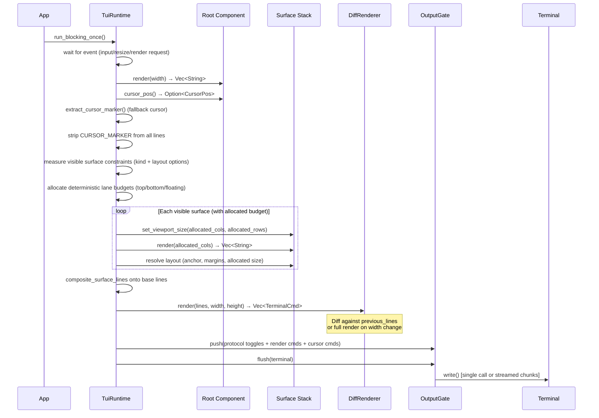
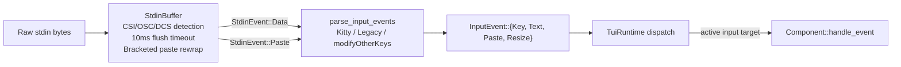

# `tape_tui` — Architecture Overview

**`tape_tui`** is a Rust port of the TypeScript `pi-tui` terminal UI library (from [`pi-mono/packages/tui`](https://github.com/badlogic/pi-mono/packages/tui)). It's a **~18k LOC** crate that provides a retained-mode, inline-first TUI framework with ANSI diff rendering, surface compositing, and IME-safe cursor management.

## Crate Layout

```
tape_tui (Cargo.toml)
├── src/
│   ├── lib.rs              ← public API surface (re-exports)
│   ├── config.rs           ← env-based config (TAPE_HARDWARE_CURSOR, etc.)
│   ├── logging.rs          ← debug/render logging
│   ├── core/               ← pure types, traits, helpers
│   │   ├── component.rs    ← Component + Focusable traits
│   │   ├── terminal.rs     ← Terminal trait + TerminalGuard RAII
│   │   ├── output.rs       ← OutputGate (single write gate)
│   │   ├── cursor.rs       ← CURSOR_MARKER extraction
│   │   ├── input.rs        ← Key parsing (Kitty + legacy)
│   │   ├── input_event.rs  ← InputEvent enum
│   │   ├── keybindings.rs  ← EditorAction + keybindings manager
│   │   ├── autocomplete.rs ← Autocomplete providers
│   │   ├── fuzzy.rs        ← Fuzzy matching
│   │   ├── editor_component.rs ← EditorComponent trait
│   │   ├── terminal_image.rs   ← Kitty/iTerm2 image protocol
│   │   └── text/           ← ANSI-aware text engine
│   │       ├── width.rs    ← visible_width (grapheme + emoji)
│   │       ├── slice.rs    ← slice_by_column, wrap_text_with_ansi
│   │       ├── ansi.rs     ← ANSI escape extraction
│   │       └── utils.rs    ← truncate, background, segmentation
│   ├── platform/           ← OS integration
│   │   ├── process_terminal.rs ← Unix raw mode, signal/panic hooks
│   │   └── stdin_buffer.rs     ← CSI/OSC/DCS buffering + paste detection
│   ├── render/             ← rendering pipeline
│   │   ├── frame.rs        ← Span → Line → Frame typed model
│   │   ├── renderer.rs     ← DiffRenderer (diff + full render)
│   │   └── surface.rs      ← Surface layout + compositing
│   ├── runtime/            ← event loop orchestration
│   │   ├── tui.rs          ← TuiRuntime (the main runtime)
│   │   ├── component_registry.rs ← ComponentId + runtime-owned component storage
│   │   ├── inline_viewport.rs ← runtime-owned inline viewport anchor/clamp state
│   │   ├── surface.rs      ← runtime surface IDs/options/input policies
│   │   └── ime.rs          ← Hardware cursor positioning
│   └── widgets/            ← 12 component widgets
│       ├── editor.rs       ← Multi-line editor (3137 LOC, largest)
│       ├── markdown.rs     ← Markdown renderer
│       ├── input.rs        ← Single-line input
│       ├── select_list.rs  ← Selection list
│       ├── settings_list.rs← Settings UI
│       ├── text.rs, box.rs, container.rs, spacer.rs
│       ├── image.rs, loader.rs, cancellable_loader.rs
│       └── truncated_text.rs
├── tests/                  ← Golden + integration tests
└── examples/               ← chat-simple, markdown-playground, ansi-forensics
```

## Layered Architecture

```mermaid
graph TB
    subgraph "Application Layer"
        APP[User Application / Examples]
    end

    subgraph "Widgets Layer"
        EDITOR[Editor]
        INPUT[Input]
        MD[Markdown]
        SELECT[SelectList]
        SETTINGS[SettingsList]
        TEXT[Text / Box / Container]
        IMAGE[Image]
        LOADER[Loader / CancellableLoader]
    end

    subgraph "Runtime Layer"
        TUI["TuiRuntime&lt;T: Terminal&gt;"]
        FOCUS[FocusState]
        IME[IME Cursor]
        WAKE[RuntimeWake<br/>Condvar + Mutex]
    end

    subgraph "Render Layer"
        FRAME["Frame (Span → Line → Frame)"]
        DIFF[DiffRenderer]
        SURFACECMP[Surface Compositing]
    end

    subgraph "Core Layer"
        COMP["Component trait"]
        OUTGATE["OutputGate<br/>(single write gate)"]
        TERMTRAIT["Terminal trait"]
        CURSOR[Cursor Marker]
        KEYS["Key Parsing<br/>(Kitty + Legacy)"]
        TEXTENG["Text Engine<br/>(width / slice / ANSI)"]
        AUTOCOMPLETE[Autocomplete]
        FUZZY[Fuzzy Match]
        KEYBIND[Keybindings]
        TERMIMG[Terminal Image]
    end

    subgraph "Platform Layer"
        PROCTERM["ProcessTerminal<br/>(Unix raw mode)"]
        STDIN["StdinBuffer<br/>(ESC sequence buffering)"]
        HOOKS["Signal + Panic Hooks<br/>(lock-free cleanup)"]
        HOOKTERM["HookTerminal<br/>(/dev/tty crash writer)"]
    end

    APP --> TUI
    APP --> EDITOR & INPUT & MD & SELECT & SETTINGS & TEXT & IMAGE & LOADER

    EDITOR & INPUT & MD & SELECT & SETTINGS & TEXT & IMAGE & LOADER -.->|implement| COMP
    EDITOR & INPUT -.->|use| KEYBIND & AUTOCOMPLETE

    TUI --> COMP
    TUI --> DIFF & SURFACECMP & FRAME
    TUI --> FOCUS & IME & WAKE
    TUI --> OUTGATE
    TUI --> CURSOR
    TUI --> HOOKS

    DIFF --> TEXTENG
    SURFACECMP --> TEXTENG

    OUTGATE -->|"flush()"| TERMTRAIT
    PROCTERM -.->|implements| TERMTRAIT
    PROCTERM --> STDIN
    PROCTERM --> HOOKS
    HOOKTERM -.->|crash-safe write| TERMTRAIT

    style OUTGATE fill:#ff9999,stroke:#cc0000,stroke-width:3px
    style TUI fill:#9999ff,stroke:#0000cc,stroke-width:3px
```



## Key Architectural Invariants

### 1. Single Output Gate

The **cardinal rule**: all frame/diff rendering output flows through `OutputGate::flush()`. No widget, no renderer, no component ever calls `Terminal::write()` directly for rendering. The `OutputGate` collects typed `TerminalCmd`s (cursor moves, protocol toggles, raw bytes) and flushes them in a single batch, or streams them in 16KB chunks if the payload exceeds 64KB. Out-of-band controls like setting the window title are allowed, but must still flow through `OutputGate` (via `TuiRuntime::set_title(..)`, `RuntimeHandle::dispatch(Command::SetTitle(..))`, or `TerminalTitleExt::set_title(..)` when you own the terminal) to preserve ordering with frame output.

This invariant is guaranteed in default/safe builds for runtime rendering and command processing. The optional `unsafe-terminal-access` feature is an explicit escape hatch for raw bytes through `TuiRuntime::terminal_guard_unsafe().write_raw(..)`. That bypass is intentional and opt-in. Its contract is:
- callers must not leave terminal state incompatible with the diff renderer,
- guard drop requests a full redraw + render (self-healing on next tick),
- raw writes are never part of the safe-mode guarantee.
- crash/signal teardown uses `HookTerminal` best-effort writes by design and is outside normal frame/diff flow.

### Unsafe Escape Hatch Contract

`unsafe-terminal-access` is not a fallback path for normal rendering. It exists for advanced Rust extensions that require raw terminal control sequences not modeled by `TerminalCmd`. The guard is intentionally write-only (`write_raw(&str)`) and does not expose terminal lifecycle methods. Consumers accept responsibility for temporary renderer/terminal desync until the next scheduled repaint.

### 2. Component Model (Retained Mode)

Every UI element implements the `Component` trait:

```rust
trait Component {
    fn render(&mut self, width: usize) -> Vec<String>; // -> lines of ANSI text
    fn set_viewport_size(&mut self, _cols: usize, _rows: usize) {}
    fn handle_event(&mut self, _event: &InputEvent) {}
    fn cursor_pos(&self) -> Option<CursorPos> { None }
    fn invalidate(&mut self) {}
    fn set_terminal_rows(&mut self, _rows: usize) {}
    fn wants_key_release(&self) -> bool { false }
    fn as_focusable(&mut self) -> Option<&mut dyn Focusable> { None }
}
```

Components are **pure renderers**: they return lines of text, never write to the terminal. The runtime owns all I/O.

### 3. Deterministic Render Pipeline



Render scheduling is **coalesced**: `run_blocking_once()` waits for an event, then drains queued work in a bounded, non-blocking window and renders at most once. If the coalescing budget expires while work remains queued, rendering proceeds with the drained work and the remaining work is deferred to the next tick. `run_once()` remains a strict single-iteration path, and `render_now()` is the explicit escape hatch for immediate output. Inline viewport anchoring/clamp state is runtime-owned (`runtime/inline_viewport.rs`) and recomputed deterministically on resize/content updates.

### 4. Diff Rendering

The `DiffRenderer` keeps `previous_lines` and only emits ANSI cursor-move + rewrite sequences for lines that changed. On width changes, it does a full clear. All renders are wrapped in synchronized output (`CSI ?2026 h/l`) to prevent flicker.

### 5. Surface Compositing

Surfaces are a managed stack on top of the root component.

Each surface has:

- **Layout options**: anchor point, size (absolute or %), margins, offsets
- **Input policy**: `Capture` or `Passthrough` for deterministic routing
- **Surface kind**: `Modal`, `Drawer`, `Corner`, `Toast`, `AttachmentRow` for lane defaults
- **Two-pass sizing**: visible surfaces are measured first, then allocated deterministic lane budgets before render
- **Focus management**: `pre_focus` saves the previously focused component for restoration
- **Z-order controls**: deterministic `bring_to_front`, `send_to_back`, `raise`, `lower` mutations
- **Compositing**: surfaces are spliced into the base frame line-by-line using `extract_segments()` + `slice_with_width()` from the text engine

Input dispatch uses an internal `Consumed`/`Ignored` result model. Runtime arbitration is capture-first, then deterministic fallback (pre-focus/focused/root) when a capture target ignores an event.
Visible/hidden status gates input ownership even after reorder mutations; hidden surfaces can be reordered without becoming capture winners.

Sizing/compositing constraints are now deterministic under tiny terminals:
- hidden surfaces are excluded from the active measure/allocate budget,
- lane allocations are clamped to terminal bounds,
- later lane surfaces may receive a zero-row budget when earlier lane occupants consume constrained space.

Surface lifecycle now also supports atomic transaction commands: an ordered list of
`SurfaceTransactionMutation` entries can be applied in one command boundary. The runtime applies
entries in-order, performs focus reconciliation after the ordered apply stage, and requests render
once for the transaction boundary when any effective state changed. Invalid targets emit ordered
runtime diagnostics (`command.surface_transaction.*`) while valid entries still apply.

Z-order mutations are available through three coherent paths:
- raw runtime commands (`Command::{BringSurfaceToFront, SendSurfaceToBack, RaiseSurface, LowerSurface}`),
- background-safe RuntimeHandle helpers (`bring_surface_to_front`, `send_surface_to_back`, `raise_surface`, `lower_surface`),
- SurfaceHandle ergonomics (`bring_to_front`, `send_to_back`, `raise`, `lower`) that enqueue commands and apply at tick boundaries.

Transaction non-goals remain explicit in architecture scope:
- transaction payloads do not yet include z-order mutation variants,
- no insert-before viewport fast path.

### 6. Input Pipeline



The `StdinBuffer` handles escape sequence framing with a 10ms idle timeout, high-bit byte conversion (alt-key), and bracketed paste detection. Raw sequences are then parsed into `InputEvent`s with Kitty keyboard protocol support and legacy fallbacks. Runtime routing then applies deterministic capture-first bubbling: try the topmost visible capture surface first, and if ignored, route to deterministic pre-focus/focused/root fallback targets.

### 7. Crash Safety (RAII + Lock-Free)

- **`TerminalGuard<T>`**: RAII wrapper that drains input and calls `stop()` on drop
- **Signal hooks**: `SIGINT`/`SIGTERM`/`SIGHUP` trigger `CrashCleanup` (show cursor, disable bracketed paste, disable Kitty)
- **Panic hooks**: Process-global wrapper with a **lock-free cleanup registry** (atomic linked list of `PanicCleanupNode`s). Cleanups run at-most-once via `AtomicBool`. Nodes are intentionally leaked to avoid ABA on the panic path.
- **`HookTerminal`**: Opens `/dev/tty` directly with `O_NONBLOCK` for crash-safe writes (no stdout/stderr dependency, never blocks)

### 8. Text Engine (`core::text`)

ANSI-aware text processing underpins both rendering and compositing:

- **`visible_width()`**: grapheme-cluster width using Unicode + emoji rules
- **`slice_by_column()`**: column-accurate slicing that preserves ANSI state
- **`wrap_text_with_ansi()`**: word-wrapping that carries ANSI attributes across line breaks
- **`extract_segments()`**: decomposes a line into styled segments for surface compositing

### 9. Runtime Diagnostics and Invalid Command Handling

Runtime mutation errors are observable in all builds:
- `set_on_diagnostic(..)` installs a diagnostics sink for warnings/errors.
- without a sink, diagnostics fall back to `stderr`.
- invalid raw command IDs (`RootSet`/`RootPush`/focus/surface mutations) emit structured diagnostics instead of failing silently.
- command handling remains deterministic and non-panicking for invalid IDs.

## Dependencies (Minimal)

Only 6 external crates—no async runtime, no `crossterm`/`termion`:

- `libc` + `signal-hook` — Unix raw mode, signals
- `unicode-segmentation` + `unicode-width` — grapheme/width
- `emojis` — RGI emoji detection
- `markdown` — Markdown AST parsing

## Current Status

The core pipeline (terminal → input → component → render → output) is operational. All 12 widgets are implemented, including the multi-line `Editor` with autocomplete, undo/redo, and kill/yank. The codebase targets behavioral parity with the TypeScript reference where architecture and determinism constraints align.

## Verification Modes

Maintain both runtime contracts with two required test runs:
- safe/default mode: `cargo test`
- unsafe escape-hatch mode: `cargo test --features unsafe-terminal-access`

These two commands are the required local verification matrix before merging runtime/output changes.
